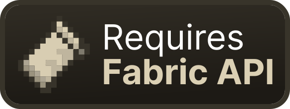

<a href="https://modrinth.com/mod/fabric-api">
    
</a>

<a href="https://discord.gg/t5ZqftXG4b">
    
</a>

<a href="https://modrinth.com/mod/elegantia">
    
</a>

# Elegantia
It is used in Araraki Leo mods. Contains tools:
- GUI and graphics (widgets, drawers, drawables)
- for textures
- for resource packs
- quick configuration
- modrinth update checker
- math interfaces
- world utils
- other utils

### Getting started
Insert in `build.gradle`

```groovy
repositories {
    maven {
        url = "https://api.modrinth.com/maven"
    }
}

dependencies {
    modImplementation "maven.modrinth:elegantia:0.0.1+fabric-1.21"
}
```

<details><summary>Insert in <code>build.gradle.kts</code></summary>

```groovy
repositories {
    maven("https://api.modrinth.com/maven")
}

dependencies {
    modImplementation("maven.modrinth", "elegantia", "0.0.1+fabric-1.21")
}
```
</details>

### Page badges
You can place badges on your project page to improve the perception of the posted information, as well as to improve the appearance of the page:

<a href="https://modrinth.com/mod/elegantia">
    
</a>

```html
<a href="https://modrinth.com/mod/elegantia">
    
</a>
```

<a href="https://modrinth.com/mod/fabric-api">
    
</a>

```html
<a href="https://modrinth.com/mod/fabric-api">
    
</a>
```

<a href="https://modrinth.com/mod/rei">
    
</a>

```html
<a href="https://modrinth.com/mod/rei">
    
</a>
```

<a href="https://modrinth.com/mod/modmenu">
    
</a>

```html
<a href="https://modrinth.com/mod/modmenu">
    
</a>
```

<a href="https://discord.gg/t5ZqftXG4b">
    
</a>

```html
<a href="Insert your discord invite here">
    
</a>
```

<a href="https://modrinth.com/mod/elegantia">
    
</a>

```html
<a href="Insert your modrinth project link here">
    
</a>
```
